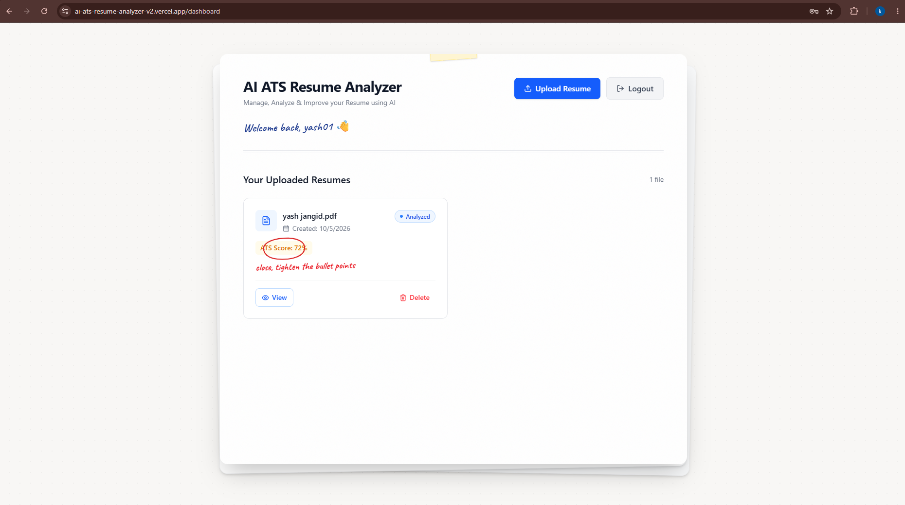
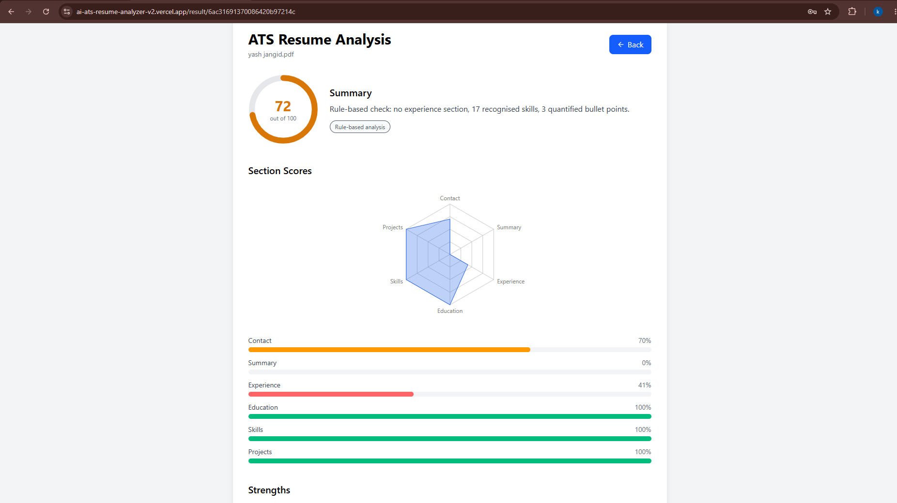

# AI ATS Resume Analyzer

Full-stack MERN app that scores resumes against ATS criteria. It uses Google Gemini for AI feedback and falls back to an offline rule-based analyzer when the AI is rate-limited or unavailable.

**Live demo:** https://ai-ats-resume-analyzer-v2.vercel.app
(The backend runs on a free tier, so the first request after inactivity can take up to a minute.)

## Screenshots

| Dashboard                        | Analysis                   |
| -------------------------------- | -------------------------- |
|  |  |

## Features

- JWT authentication (register, login, protected routes)
- Upload PDF or DOCX resumes with text extraction
- AI analysis with Gemini: ATS score, strengths, weaknesses, missing skills, bullet rewrites
- Offline rule-based fallback: analysis never fails when the AI is busy
- Job-description keyword matching
- Section score radar chart and score history over time
- Downloadable PDF report
- Rate limiting, input validation, helmet and secure file upload (type and size checks)

## Tech Stack

**Frontend:** React, Vite, Tailwind CSS, React Router, Axios, Recharts
**Backend:** Node.js, Express, MongoDB (Mongoose), JWT, Multer, pdf-parse, mammoth
**AI:** Google Gemini API
**Deployment:** Vercel (client), Render (server), MongoDB Atlas

## Architecture

```
React (Vercel) -> Express API (Render) -> MongoDB Atlas
                        |
                        +-> Gemini API (primary)
                        +-> Rule-based analyzer (fallback)
```

## Run locally

```bash
git clone https://github.com/itzzkansh/AI-ATS-Resume-Analyzer-v2.git

cd server && npm install && cp .env.example .env   # fill in your values
npm run dev

cd ../client && npm install && cp .env.example .env
npm run dev
```

## API

| Method | Endpoint                  | Description                 |
| ------ | ------------------------- | --------------------------- |
| POST   | /api/auth/register        | Create account              |
| POST   | /api/auth/login           | Log in                      |
| GET    | /api/auth/me              | Current user                |
| POST   | /api/resume/upload        | Upload and analyze a resume |
| GET    | /api/resume/history       | List your resumes           |
| GET    | /api/resume/:id           | Get one analysis            |
| POST   | /api/resume/:id/reanalyze | Re-run analysis             |
| DELETE | /api/resume/:id           | Delete a resume             |

## What I learned

- Designing for unreliable third-party APIs: retries, quotas and graceful degradation
- Deploying a split frontend and backend, and debugging CORS across origins
- Hybrid scoring that combines deterministic rules with LLM output
